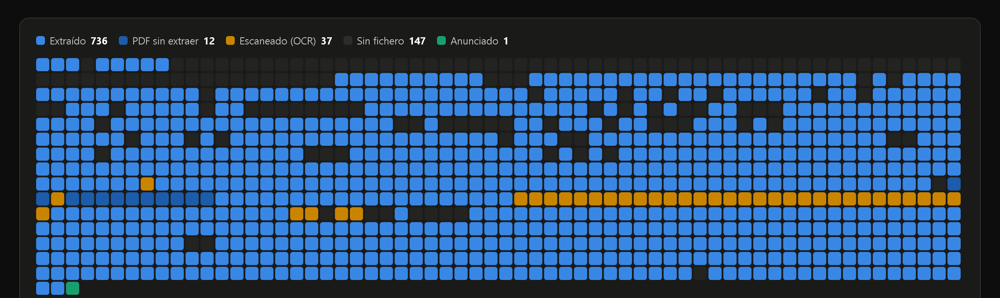
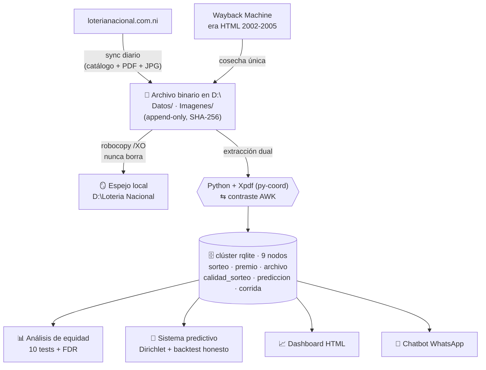

# PRC Lotería Nacional 🇳🇮

**Pipeline de archivo, extracción y análisis estadístico de los sorteos de la Lotería Nacional de Nicaragua (2002–2026).**

> Proyecto **educacional y de preservación de datos**: descarga y resguarda las listas oficiales de premios, extrae cada número ganador con métodos redundantes, carga todo en una base de datos distribuida y responde con estadística rigurosa la pregunta que todo el mundo se hace: **¿está arreglada la lotería?**
>
> *Spoiler honesto: en 9 de 10 pruebas, no. Pero hay un hallazgo real — sigue leyendo.*

---

**🌐 [Sitio del proyecto](https://zeus555.github.io/loteria-nacional-nicaragua/)** · **📊 [Dashboard de datos](https://zeus555.github.io/loteria-nacional-nicaragua/Documentaci%C3%B3n/Dashboard%20Estado%20de%20Datos.html)** · **🗺️ [Mapa animado de premios](https://zeus555.github.io/loteria-nacional-nicaragua/Documentaci%C3%B3n/Mapa%20Premios.html)**

## 🎬 Video explicativo

**[▶ Verlo en el sitio del proyecto](https://zeus555.github.io/loteria-nacional-nicaragua/#el-proyecto-en-90-segundos)** (1 min 29 s, sin narración) — un recorrido animado por la arquitectura, el pipeline diario y los hallazgos estadísticos.

Se reproduce en el navegador desde ahí. El MP4 también está versionado en [`videos/.../renders/video.mp4`](videos/loteria-nacional-explicado/renders/video.mp4), pero GitHub no reproduce vídeos del repositorio: ese enlace lleva a una página de descarga. Producido con [HyperFrames](https://github.com/heygen-com/hyperframes) (vídeo renderizado desde HTML); la fuente completa vive en [`videos/loteria-nacional-explicado/`](videos/loteria-nacional-explicado/).

## Tabla de contenido

- [¿Qué hace este proyecto?](#qué-hace-este-proyecto)
- [Arquitectura](#arquitectura)
- [Principios de diseño](#principios-de-diseño)
- [Estructura del repositorio](#estructura-del-repositorio)
- [El pipeline diario](#el-pipeline-diario)
- [Base de datos (rqlite)](#base-de-datos-rqlite)
- [Hallazgos estadísticos](#hallazgos-estadísticos)
- [Respaldo de los datos](#respaldo-de-los-datos)
- [Cómo ejecutarlo](#cómo-ejecutarlo)
- [Historia del proyecto](#historia-del-proyecto)
- [Descargo de responsabilidad](#descargo-de-responsabilidad)

---

## ¿Qué hace este proyecto?

Cada semana la Lotería Nacional de Nicaragua publica en [loterianacional.com.ni](https://loterianacional.com.ni) la lista oficial de premios de cada sorteo como un PDF. Este proyecto:

1. **Archiva** — descarga y conserva cada PDF e imagen publicados, sin sobrescribir ni borrar jamás (más de 800 sorteos, desde el nº 1356 de 2006; la era 2002–2005 se rescató del [Wayback Machine](https://web.archive.org)).
2. **Extrae** — lee los ~658 números premiados de cada lista con **dos métodos independientes** (un parser Python que reconstruye la cuadrícula a partir de las coordenadas que da `pdftohtml`, y los scripts AWK legado como contraste), y valida que ambos coincidan.
3. **Controla calidad** — verifica cantidad esperada de premios por era, congruencia jerárquica (MAYOR > SEGUNDO > TERCER…), hash SHA-256 de cada archivo, y asigna un *score* de calidad por sorteo.
4. **Analiza** — corre una batería de 10 pruebas estadísticas de equidad (χ², Kolmogorov–Smirnov, rachas, autocorrelación, colisiones de cumpleaños, deriva temporal) con corrección por comparaciones múltiples.
5. **Predice honestamente** — un modelo Dirichlet-multinomial con *backtesting walk-forward* que **admite abiertamente cuando no supera al azar** — y cuantifica la única ventaja real que los datos respaldan.
6. **Publica** — todo queda consultable en un clúster distribuido [rqlite](https://rqlite.io) de 9 nodos (teléfonos Android reciclados) y en un dashboard HTML, incluso vía un chatbot de WhatsApp ("¿qué salió en el sorteo 2287?").

### El archivo, de un vistazo

Cobertura sorteo por sorteo (1356 → 2288): cada celda es un sorteo — azul = premios extraídos en la base de datos, azul oscuro = PDF válido pendiente de parser especial, naranja = escaneado (requiere OCR/transcripción), gris = sin fichero en línea, verde = anunciado.



**[▶ Abrir el dashboard interactivo](https://zeus555.github.io/loteria-nacional-nicaragua/Documentaci%C3%B3n/Dashboard%20Estado%20de%20Datos.html)** — la misma tira con tooltip por sorteo, la batería de equidad completa y un **mapa de Nicaragua navegable por departamento** con los montos de premios ubicados en cada uno. Y **[▶ el mapa animado](https://zeus555.github.io/loteria-nacional-nicaragua/Documentaci%C3%B3n/Mapa%20Premios.html)**, que reproduce año por año dónde cayó cada premio destacado.

> Los dos son HTML autocontenidos: se abren igual con doble clic desde `Documentación/`, sin servidor ni dependencias.

## Arquitectura



## Principios de diseño

Estos seis principios nacieron de fallas reales encontradas al auditar el sistema anterior:

| # | Principio | Por qué |
|---|-----------|---------|
| 1 | **El archivo binario es sagrado.** PDFs e imágenes nunca se sobrescriben ni borran; cada fichero queda registrado con SHA-256 y el espejo es solo-añadir. | Los datos originales son irrecuperables si el sitio los quita. |
| 2 | **Los BLOBs no van a la base de datos.** A rqlite solo van metadatos y premios (~60 MB); los binarios viven en disco. | Raft replicaría ~450 MB a 9 teléfonos con almacenamiento limitado. |
| 3 | **La verdad del número de sorteo se lee DENTRO del PDF**, nunca del nombre del fichero ni del HTML. | Se descubrió un corrimiento: el `.Info` del sorteo N enlazaba el PDF del N−1. |
| 4 | **Toda la BD es re-derivable desde el archivo.** Si el clúster se pierde, se reconstruye desde los ficheros. | La BD es una vista; el archivo es la fuente de verdad. |
| 5 | **Ninguna etapa falla en silencio.** Extraer 0 filas es una alerta, no un "Fin" exitoso. | La ingesta estuvo rota días sin que nadie lo notara. |
| 6 | **Extracción dual.** Todo número se extrae por dos métodos independientes; las discrepancias van a cola de revisión. | Un solo parser tiene puntos ciegos (capas de texto duplicadas, encabezados que interfieren…). |

## Estructura del repositorio

```
PRC Loteria Nacional/
├── Datos/            # 📄 Los PDFs oficiales (NNNN.pdf) + NNNN.Info de metadatos — EL ARCHIVO
│   └── HtmlViejo/    #    era HTML 2002-2005 rescatada del Wayback Machine
├── Imagenes/         # 🖼️ JPGs del "número de la suerte" publicados junto a cada lista
├── Script/           # ⚙️ Todo el código del pipeline
│   ├── TareaDiaria.ps1          #  orquestador diario (7 pasos, ver abajo)
│   ├── GetSorteos.bat / .awk    #  sincronización con el sitio web
│   ├── ExtraePremiosV2.py       #  extractor principal (coordenadas vía pdftohtml)
│   ├── ExtraePremiosRaw.py      #  extractor de respaldo (modo tabla / zip FIFO)
│   ├── ExtraeNotasMayor.py      #  canal NOTA: los 4 dígitos finales del mayor, en texto plano
│   ├── ControlCantidad.py       #  ¿salieron los ~658 números esperados?
│   ├── ControlCongruencia.py    #  jerarquía MAYOR > SEGUNDO > TERCER…
│   ├── AnalisisEquidad.py       #  batería de 10 tests estadísticos + FDR
│   ├── AnalisisRepetidos.py     #  ¿ganadores repetidos sospechosos? (Poisson)
│   ├── AnalisisCobertura.py     #  payout ratio y "ventanas Selbee"
│   ├── AnalisisCuestionamientos.py  # los 3 reclamos públicos, contrastados
│   ├── SistemaPredictivo.py     #  Dirichlet-multinomial + backtest honesto
│   ├── CargaRqlite.ps1          #  carga masiva al clúster (multi-VALUES, 1000/req)
│   ├── EsquemaRqlite.sql        #  esquema de la base de datos
│   └── Historico/               #  versiones anteriores de los scripts (arqueología)
├── Resultados/       # 📊 CSVs de extracción, reportes JSON de cada análisis, predicciones
├── Documentación/    # 📚 Dashboard, mapa animado, propuesta de modernización, hojas históricas
├── Web/              # 🌐 server.js — servidor local opcional (franja "EN VIVO" contra el clúster)
├── videos/           # 🎬 Proyecto HyperFrames del explicador + el MP4 renderizado
├── Nuevos/           # 🧾 Salidas intermedias del pipeline AWK (los PDFs duplican Datos/)
├── Modelo Predictivo/  # 🧪 experimentos de 2017 (TensorFlow/MNIST) — pieza de museo
├── Log/              # 📝 un log por corrida diaria (excluido del repo)
└── Temporal/         # ⏳ área de trabajo (excluida del repo)
```

## El pipeline diario

[`Script/TareaDiaria.ps1`](Script/TareaDiaria.ps1) encadena las 7 etapas. Si cualquiera falla, la corrida termina con error visible y queda registrada:

| Paso | Qué hace | Herramienta |
|------|----------|-------------|
| 1. Sincronización | Descarga catálogo, PDFs y JPGs nuevos del sitio oficial; valida cabecera `%PDF-` y tamaño mínimo | `GetSorteos.bat` + AWK + curl |
| 2. Extracción | Parsea solo los PDFs nuevos (`--nuevos`) → filas `sorteo\|tipo\|numero\|monto\|confianza` | `ExtraePremiosV2.py` |
| 3. Carga | Inserta premios en lotes transaccionales de 1000; refresca metadatos y hashes | REST a rqlite |
| 4. Calidad | Congruencia jerárquica (auto-corrige con auditoría) + recálculo del score 0-100 por sorteo | `ControlCongruencia.py` |
| 5. Predicción | Regenera notas del mayor y la predicción del próximo sorteo | `SistemaPredictivo.py` |
| 6. Espejo | `robocopy /E /XO` a la segunda ubicación — **solo añade, nunca borra** | robocopy |
| 7. Registro | Inserta la corrida en la tabla `corrida` (inicio, fin, filas, ok/errores) | rqlite |

Detalle robusto: el clúster de teléfonos pierde el líder Raft transitoriamente, así que **todo escritor reintenta con redescubrimiento de líder** (consulta `/status` a 4 nodos semilla).

## Base de datos (rqlite)

[rqlite](https://rqlite.io) = SQLite replicado por consenso Raft. Aquí corre en **9 teléfonos Android reciclados** — tolerante a fallos y de costo cero. Esquema completo en [`Script/EsquemaRqlite.sql`](Script/EsquemaRqlite.sql):

| Tabla | Contenido |
|-------|-----------|
| `sorteo` | Catálogo maestro: número, tipo (ordinario/extraordinario), fecha, nombre conmemorativo, URLs |
| `premio` | Cada número premiado: tipo de premio, número (texto de 5 dígitos — conserva ceros), monto, **método de extracción y confianza** |
| `archivo` | Manifiesto de integridad: ruta, SHA-256, bytes, **número interno leído del PDF**, estado |
| `calidad_sorteo` | Scorecard 0-100 por sorteo: completitud, congruencia, acuerdo entre métodos |
| `catalogo_web` | Snapshot diario de lo que publica el sitio (detecta faltantes y cambios) |
| `prediccion` | Predicciones versionadas por modelo y ámbito, con su veredicto honesto |
| `corrida` | Auditoría de cada ejecución del pipeline |
| `no_encontrado` | Correcciones manuales documentadas |

> **Nota de seguridad, por honestidad:** este clúster corre **sin autenticación**, por HTTP plano y en una LAN doméstica — las IPs semilla que verás en los scripts son direcciones privadas (`192.168.x`), inalcanzables desde internet. Es una decisión deliberada para un laboratorio casero, **no** una configuración apta para producción. Si reproducís este montaje en una red que no controlás por completo, activá autenticación y TLS en rqlite antes de cargar nada.

## Hallazgos estadísticos

*El corazón educacional del proyecto.* Batería de 10 pruebas sobre el premio mayor a lo largo de 24 años (sorteos 1138–2287), con corrección FDR de Benjamini–Hochberg — porque con 10 tests, algún p < 0.05 aparece solo, y un informe sin esa corrección mentiría.

Dos series alimentan la batería, y conviene no confundirlas: las pruebas de **dígitos** (último, decenas, centenas, millares, últimos dos y deriva temporal) usan las **797 lecturas del canal NOTA**, que publica los cuatro dígitos finales del mayor en texto plano; las que necesitan el **número completo** (Kolmogorov–Smirnov, rachas, autocorrelación y repeticiones exactas) usan los **779 mayores** reconstruidos por entero. De ahí que el esperado por dígito sea 79.7 y no 77.9.

### ✅ 9 de 10 pruebas: compatible con un sorteo justo

Kolmogorov–Smirnov sobre el número completo, rachas par/impar, autocorrelación entre sorteos, repeticiones exactas ("cumpleaños"), deriva temporal, millares, centenas, decenas… todo dentro de lo esperado por azar. Los reclamos populares tampoco se sostienen:

- **"Un número ganó dos veces en sorteos cercanos"** — sobre 836 sorteos se observan **6 repeticiones** con diez o menos sorteos de separación, y el azar predice **5.69** (p = 0.50). Con una media de 6.38 premios destacados por sorteo, estas coincidencias son *esperables*.
- **"Sequías de terminaciones imposibles"** — la racha máxima de 71 sorteos sin terminación 1 es normal (mediana Monte Carlo: 66; p = 0.35).
- **Cero casos en 24 años** de un número con dos premios destacados la misma noche (esperados 0.27; p = 1.00).

### ⚠️ El hallazgo real: el último dígito está sesgado

**El último dígito del premio mayor favorece al 9 (+37%) y al 5 (+25%)**: aparecen 109 y 100 veces frente a las 79.7 que tocarían — χ² = 28.4, p = 0.0008, el único test que sobrevive la corrección FDR. El sesgo es **estable a lo largo de 24 años** (homogeneidad temporal p = 0.26) y la era 2002–2005 lo corrobora de forma independiente.

**Interpretación honesta:** sesgo físico de la tómbola de unidades (bolillas/cápsulas desgastadas o desbalanceadas), no fraude — un fraude mostraría deriva temporal o correlaciones, y no hay ninguna.

### 🔮 ¿Se puede aprovechar? El veredicto del predictor

- Ningún modelo supera al uniforme en log-loss (Dirichlet z = −0.37). **Predecir el número completo es imposible y este sistema lo dice con números.**
- Pero la terminación 9 sale en el **13.7%** de los sorteos en vez del 10% que tocaría. Como el premio por terminación paga 2× el billete, su valor esperado es **C$162.5 frente a los C$120.0 de una terminación media — un +35%**, la única ventaja respaldada por los datos (cifras de `Resultados/Prediccion.json`, que se regenera en cada corrida).
- Payout ratio histórico (premios/ventas): mediana **51.2%**. En 24 años hubo **una sola** ventana estilo [Jerry Selbee](https://en.wikipedia.org/wiki/Jerry_and_Marge_Go_Large) (sorteo 1734: comprar la emisión completa habría rendido +4.7%) — y detectarla requería información que solo se conoce después.

Reportes completos en [`Resultados/`](Resultados/): `Equidad_*.json`, `RepetidosReporte.json`, `CoberturaReporte.json`, `CuestionamientosReporte.json`, `Prediccion_*.json`.

### 🧪 Técnicas de extracción que valieron oro

- **El canal NOTA**: la nota al pie de cada lista ("LOS BILLETES TERMINADOS EN *dddd* GANAN…") publica los 4 dígitos finales del mayor en texto plano — un canal independiente del parseo de la cuadrícula, que funciona en todas las eras y sirve de árbitro cuando los métodos discrepan.
- **Nunca identificar el mayor por monto máximo**: en la era moderna el monto del mayor es arte gráfico (no texto), así que el máximo textual es el *segundo* premio.
- **El espacio muestral es la emisión, no 00000–99999**: se emiten ~46,000–61,000 billetes; todo test debe condicionar a la emisión real.

## Respaldo de los datos

Estrategia de tres niveles para que ni un PDF se pierda:

1. **Archivo primario** (`Datos/`, `Imagenes/`) — append-only; nada se sobrescribe ni borra. Los archivos mal nombrados se *copian* al nombre correcto y el original va a cuarentena.
2. **Manifiesto de integridad** — tabla `archivo` con SHA-256, tamaño y número interno de cada fichero; verificable en cualquier momento.
3. **Espejo local** — robocopy diario solo-añadir a `D:\Loteria Nacional` (paso 6 del pipeline). *Pendiente: réplica externa (nube/NAS).*

Y la garantía de fondo: **la base de datos entera es re-derivable desde el archivo** — el clúster puede perderse sin perder un solo dato.

## Cómo ejecutarlo

> **Antes de nada:** este pipeline se escribió para *una* máquina concreta, y eso se nota. Casi todos los scripts llevan la ruta del autor cableada en una constante al inicio del fichero. No es un `pip install` y listo; es un archivo de trabajo real, publicado tal cual. Abajo está exactamente qué hay que tocar.

**Requisitos**

| Qué | Para qué | Nota |
|-----|----------|------|
| Windows + PowerShell 5.1+ | orquestación (`TareaDiaria.ps1`, `CargaRqlite.ps1`) | los scripts son ASCII puro por las rarezas de codificación de PS 5.1 |
| Python 3.7+ | extractores y análisis | **solo biblioteca estándar** — la estadística (χ², KS, Poisson) está implementada a mano, sin `scipy` ni `numpy` |
| [Xpdf command line tools 4.x](https://www.xpdfreader.com/download.html) | `pdftohtml`, `pdftotext`, `pdftopng` | la extracción por coordenadas depende de ellos; la opción `-table` es exclusiva de Xpdf (Poppler no sirve) |
| gawk + curl | sincronización con el sitio y el método de contraste | |
| [rqlite](https://rqlite.io) | base de datos | un solo nodo basta: `rqlited data/` |
| Node.js 18+ | *opcional* — `Web/server.js`, que añade la franja "EN VIVO" al dashboard | el dashboard se abre igual sin él |

**Rutas que hay que ajustar** (todas son constantes en las primeras líneas de cada fichero):

- `RAIZ = r"D:\PRC Loteria Nacional"` en los 13 scripts `.py` de `Script/`.
- `PDFTOHTML`, `PDFTOTEXT`, `PDFTOPNG` — rutas absolutas a los binarios de Xpdf.
- `$DirRaiz`, `$DirEspejo`, `$Python` y `$Semillas` (las IPs del clúster) en `TareaDiaria.ps1`.
- `set path=...\GAWK\bin` en `GetSorteos.bat`.
- `CargaRqlite.ps1` no hace falta editarlo: acepta `-DirRaiz <ruta>` como parámetro.

```powershell
# 1. Crear el esquema en rqlite
#    (POST del contenido de Script\EsquemaRqlite.sql a http://<lider>:4001/db/execute)

# 2. Corrida diaria completa (sync -> extrae -> carga -> calidad -> predicción -> espejo)
powershell -ExecutionPolicy Bypass -File "Script\TareaDiaria.ps1"

# 3. Análisis bajo demanda (no necesitan el clúster: leen los CSV de Resultados\)
python Script\AnalisisEquidad.py        # batería de equidad
python Script\AnalisisRepetidos.py      # ganadores repetidos
python Script\SistemaPredictivo.py      # predicción honesta

# 4. Consultar el clúster
$sql = "SELECT tipo_premio, numero, monto FROM premio WHERE num_sorteo=2287 ORDER BY monto DESC LIMIT 5"
Invoke-RestMethod "http://<nodo>:4001/db/query?q=$([uri]::EscapeDataString($sql))"

# 5. Opcional: dashboard con la franja EN VIVO contra el clúster
node Web\server.js     # http://localhost:3020
```

## Historia del proyecto

- **2005–2017 · Era AWK**: scripts AWK + batch descargaban y tabulaban sorteos; estadísticas en ficheros de texto planos. Incluye un experimento de red neuronal de 2017 (`Modelo Predictivo/`) conservado como pieza de museo.
- **2017–2026 · El letargo**: la capa de estadísticas quedó congelada apuntando a rutas de Google Drive extintas; la descarga siguió funcionando en silencio… hasta que dejó de hacerlo.
- **Julio 2026 · La modernización** ([propuesta completa](Documentación/Propuesta%20Modernizacion%202026-07.md)): auditoría que halló la ingesta rota, PDFs corridos en 1 y 146 descargas en 0 bytes → reconstrucción total en 8 fases (F0–F7): reparación, esquema rqlite, saneamiento del archivo, extracción dual, calidad, equidad, predicción honesta y operación continua. Los AWK de 20 años no se tiraron: hoy son el método de contraste.

## Descargo de responsabilidad

Proyecto **independiente, educacional y sin fines de lucro**. No está afiliado a la Lotería Nacional de Nicaragua. Los datos provienen de las listas oficiales públicas; los análisis son estadística descriptiva e inferencial sobre datos públicos.

El código está bajo licencia [MIT](LICENSE). Los documentos oficiales archivados en `Datos/`, `Imagenes/` y `Nuevos/` son obra de su emisor original y se conservan aquí solo con fines de preservación — ver [NOTICE.md](NOTICE.md).

**Nada de esto es consejo de apuestas.** La lotería tiene valor esperado negativo (~51% de payout): jugar es entretenimiento, no inversión. El hallazgo del último dígito reduce la pérdida esperada en un componente del premio; no la convierte en ganancia.

---

*Construido con PowerShell, Python (biblioteca estándar), AWK (¡desde 2005!), Xpdf y un clúster rqlite de 9 teléfonos reciclados.*
